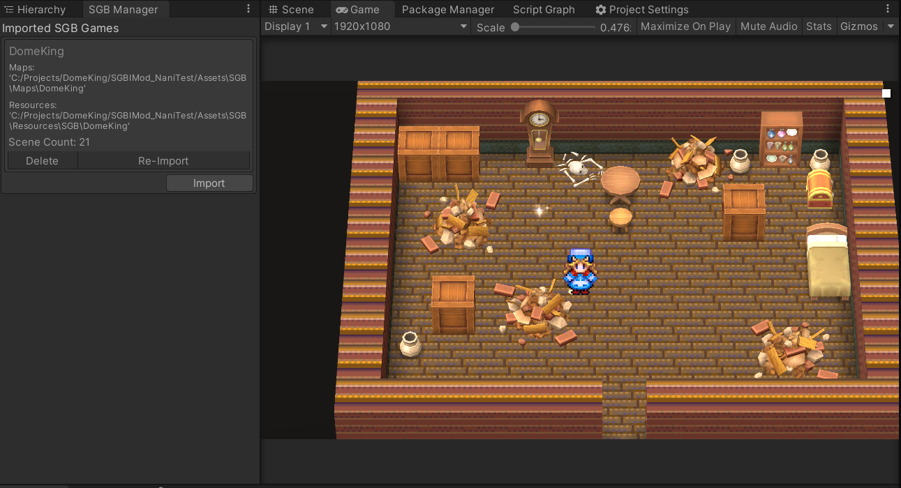

# SGB IMod



A heavy modification of [SMILE GAME BUILDER](https://store.steampowered.com/app/483950/SMILE_GAME_BUILDER/)'s [Unity Exporter](https://store.steampowered.com/app/766450/SMILE_GAME_BUILDER_Exporter_for_Unity/) Runtime that makes manipulating the runtime state easier, fixes some problems with the original runtime, and adds support for embedding multiple SGB projects in one parent Unity project.

This has been built primarily for Cobysoft Joe's [Dome-King Cabbage](https://cobysoft.co/) via the [Naninovel extension](https://github.com/BOBBO-NET/net.bobbo.sgb.imod.naninovel/) that uses this package. I don't really intend to be active on this project outside of features / fixes necessary for Dome-King - though if you find this useful and have problems with it, don't be afraid to drop a ticket in the Issues tab.

## Features

- Installable from [OpenUPM](https://openupm.com/packages/net.bobbo.sgb.imod/)
- Support for multiple SGB Unity Exports into a single project
- SGB projects can be dynamically entered and exited at runtime
  - Supports entry to the game as a whole, or a specific map
- Supports overriding how SGB reads / writes save file data streams
- Supports overriding what elements are available in SGB's pause menu
- Supports overriding what font SGB uses
- Supports manipulating SGB's volume settings and mixer routing
- Supports Unity's [Input System](https://docs.unity3d.com/Packages/com.unity.inputsystem@1.2/manual/index.html)
- Fixes visual visual bugs with the default SGB Unity Exporter Runtime
- Approve / Deny SGB loading maps for custom inter-scene navigation

## Usage

### Importing an SGB Project

1. Export an SGB Project using the Unity Exporter.
2. Open the exported Unity project at least once, with the same version of Unity that you'll use in your current project. This generates necessary assets.
3. In the project that you'd like to import the project into, open the SGB Manager window by navigating to SGB_IMOD -> SGB Manager on the top of the Unity Editor.
4. Click the Import button to open the SGB Import Wizard. Follow steps in the wizard to complete!

### Entering / Exiting an SGB Project at Runtime

For more details see [Runtime/Scripts/SGBManager.cs](Runtime/Scripts/SGBManager.cs). For a real implementation see net.bobbo.sgb.imod.naninovel's usage in [FrontendModeManager.cs](https://github.com/BOBBO-NET/net.bobbo.sgb.imod.naninovel/blob/main/Runtime/FrontendModeManager.cs).

```C#
// Enter the title screen of the game
await SGBManager.LoadSmileGameAsync("theNameOfTheGame");
```

```C#
// Load the first save file in the game
await SGBManager.LoadSmileGameAsync("someGame", 0);
```

```C#
// Load into the 2nd save file, at a specific map location
var mapLoadParams = new LoadSGBMapArgs {
    MapName = "the_shack",
    StartPosition = new Vector2Int(
        MapStartPositionX.Value, 
        MapStartPositionY.Value
    ),
    StartDirection = MapStartDirection.Value,
    StartHeight = MapStartHeight.Value
};
await SGBManager.LoadSmileGameAsync("demoGame", 1, mapLoadParams);
```

```C#
// Exit the currently loaded SGB game
await SGBManager.UnloadSmileGameAsync();
```

### Controlling Pause Menu Options

For more details see [Runtime/Scripts/SGBPauseMenuOptions.cs](Runtime/Scripts/SGBPauseMenuOptions.cs). For a real implementation see net.bobbo.sgb.imod.naninovel's usage in [SGBSaveBridgeService.cs](https://github.com/BOBBO-NET/net.bobbo.sgb.imod.naninovel/blob/main/Runtime/SGBSaveBridgeService.cs).

```C#
// Make the Exit Button invisible and non-interactable
SGBPauseMenuOptions.ExitButton.IsVisible = false
SGBPauseMenuOptions.ExitButton.IsInteractable = false
```

```C#
// Make the Save Button visible, but not-interactable
SGBPauseMenuOptions.SaveButton.IsVisible = true
SGBPauseMenuOptions.SaveButton.IsInteractable = false
```

### Override how Save Data is Read / Written to Disk

For more details see [Runtime/Scripts/SGBSaveManager.cs](Runtime/Scripts/SGBSaveManager.cs). For a real implementation see net.bobbo.sgb.imod.naninovel's usage in [SGBSaveBridgeService.cs](https://github.com/BOBBO-NET/net.bobbo.sgb.imod.naninovel/blob/main/Runtime/SGBSaveBridgeService.cs).

```C#
// Create a method that handles the raw binary data from SGB
void OnSgbSave(int saveIndex, Stream dataToSave) 
{
    Debug.Log($"Saving data for slot {saveIndex}");
    // ...and do something with the data stream
}

// Tell SGB IMod that we want to use the above function to override how SGB handles saving
SGBSaveManager.SaveDataOverrideFunc = OnSgbSave;
```

```C#
// Create a method allows SGB to read information about a specific save slot
SGBSaveManager.SGBSaveInfo OnSgbReadSaveInfo(int saveIndex)
{
    // Some logic for determining if there's not a save at this slot
    if(/* we don't have a save at `saveIndex`*/) 
    {
        return SGBSaveManager.SGBSaveInfo.NewEmpty(saveIndex);
    }

    // OTHERWISE, we DO have a save file, so
    // do some logic reading info about the save
    // and return it!
    return SGBSaveManager.SGBSaveInfo.NewReal(saveIndex, /* DateTime of when the save was last written */);
}

// Tell SGB IMod that we want to use the above function to override how SGB handles reading information about a save file
SGBSaveManager.ReadSaveInfoOverrideFunc = OnSgbReadSaveInfo
```

```C#
// Create a method that allows SGB to read raw binary data from a specific save slot
Stream OnSgbLoad(int saveIndex)
{
    // If we don't have a save file at this slot, EXIT EARLY
    if(/* we don't have a save at `saveIndex` */)
    {
        return null;
    }

    // OTHERWISE, read the binary data!
    return /* some way to read binary */
}

// Tell SGB IMod that we want to use the above function to override how SGB handles reading the raw binary data of a save slot
SGBSaveManager.LoadDataOverrideFunc = OnSgbLoad;
```

### Override SGB's Font

For more details see [Runtime/Scripts/SGBFontManager.cs](Runtime/Scripts/SGBFontManager.cs). For a real implementation see net.bobbo.sgb.imod.naninovel's usage in [SGBFontBridgeService.cs](https://github.com/BOBBO-NET/net.bobbo.sgb.imod.naninovel/blob/main/Runtime/SGBFontBridgeService.cs).

```C#
// Load a font from somewhere
var someFont = Resources.Load<Font>("myCoolFont");

// Tell SGB IMod that we want to use the above font to override the font SGB will display text with
SGBFontManager.CurrentFont = someFont;
```
